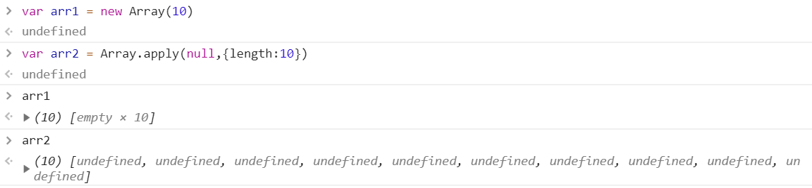
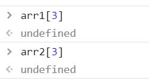
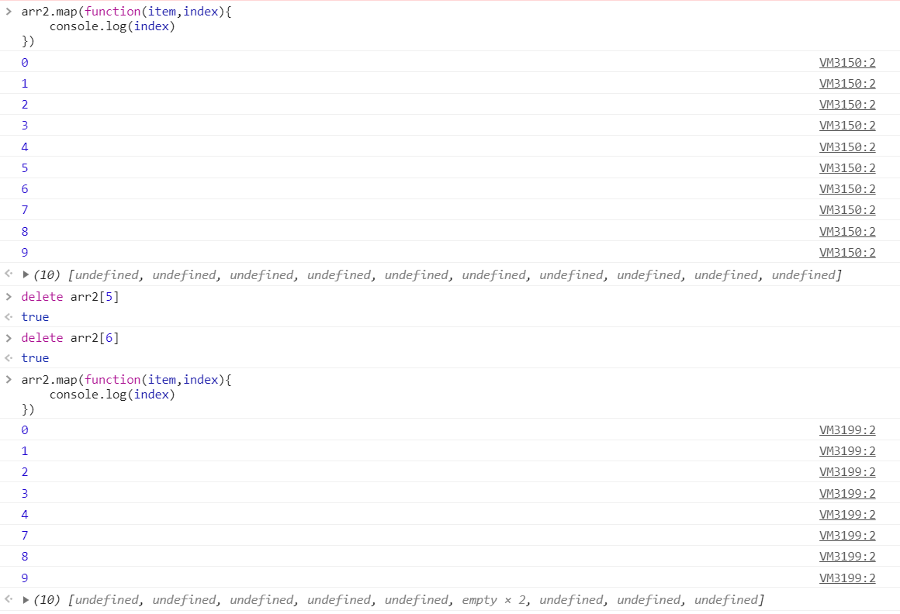

***

> git操作

使用`git reset HEAD`取消了*git add*操作
将暂存区内容清空，回到工作区

***

> 数组中的空单元

`new Array(10)` 和 `Array.apply(null,{length:10})`定义数组

*使用类数组对象可以产生非稀疏数组*

empty(空单元) 和 undefined 是有区别的

对于使用length访问来说，二者并没有区别

对于使用map、forEach这些方法来说，empty不会执行

***
